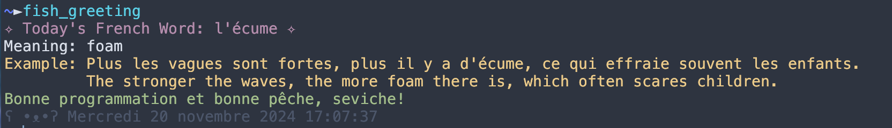

# Fish Greeting Script

This script provides a friendly greeting in the Fish shell, including a French word of the day fetched from the [Transparent Language](https://www.transparent.com/word-of-the-day/today/french) API, along with a random Kaomoji.

## Installation

1. Ensure you have the Fish shell installed on your system.
2. Make sure `curl` is installed. You can install it using your package manager, e.g., `sudo apt install curl` on Ubuntu.
3. Copy the `fish_greeting.fish` script to your Fish functions directory, typically `~/.config/fish/functions/`.

## Usage

The script runs automatically each time you start a new Fish shell session, providing you with a greeting and the French word of the day. Alternatively, you can run `fish_greeting` manually to call this function.

## Configuration

- The script caches the word of the day in `~/.cache/fish_greeting_cache.xml`. Ensure this directory is writable.
- The script uses the URL `https://wotd.transparent.com/rss/fr-widget.xml` to fetch the word of the day. You can change this URL if needed.

## Troubleshooting

- If you see an error about `curl` not being installed, make sure to install it using your system's package manager.
- If the script fails to fetch the word of the day, check your internet connection and ensure the API URL is accessible.

## License

© Sevi.C  
MIT License